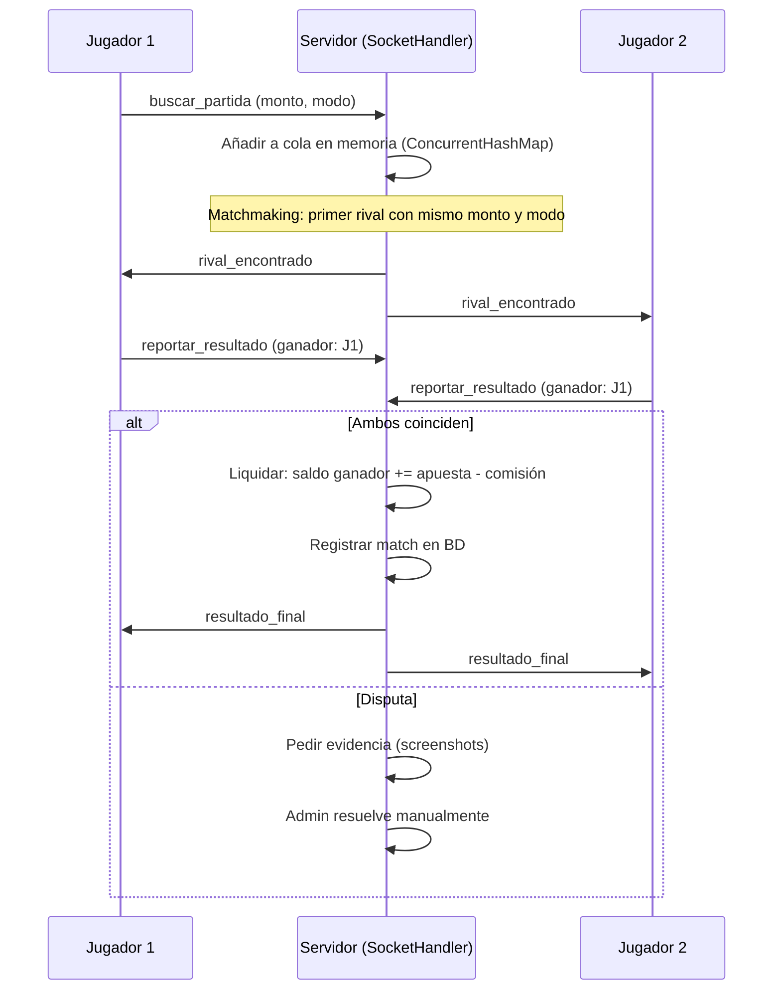

# ARCHITECTURE.md — UltimateClash (TorneosFlash)

> Documento de referencia para que cualquier modelo o desarrollador entienda el sistema.
> Última actualización: 2026-10-05

---

## 1. Stack actual

| Capa | Tecnología | Notas |
|------|-----------|-------|
| **Backend** | Java 17, Javalin 5 | Servidor HTTP + middleware |
| **WebSocket** | Adaptador custom (`socketio/`) | Emula Socket.IO sobre WS nativo de Javalin. **Migrar a netty-socketio** (pendiente) |
| **BD** | PostgreSQL (Render) | Pool: HikariCP, max 20 conexiones |
| **ORM** | Ninguno | SQL directo con `PreparedStatement` vía `GenericDAO` |
| **Auth** | Cookie `userId` en texto plano | ⚠️ **Inseguro**. Migrar a JWT httpOnly (pendiente) |
| **Frontend** | Vanilla JS (`app.js`, 120 KB) | SPA monolítica sin framework. **Migrar a React + Vite** (pendiente) |
| **Pagos** | Wompi (tarjeta), Nequi (manual) | Webhook Wompi no verifica firma |
| **Notificaciones** | Firebase Cloud Messaging (FCM) | Push via `NotificacionPushServicio` |
| **Email** | Brevo (Sendinblue) | Vía `CorreoServicio` |
| **Deploy** | Render (Docker) | UTC timezone, free tier |

---

## 2. Estructura de carpetas

```
TorneosFlash/
├── public/                          # Frontend (servido como estáticos)
│   ├── index.html                   # SPA principal
│   ├── app.js                       # Lógica completa del frontend (~2500 líneas)
│   ├── style.css                    # Estilos
│   ├── admin-db.html                # Panel admin (duplicado en raíz)
│   └── firebase-messaging-sw.js     # Service worker FCM
├── src/main/java/com/torneosflash/
│   ├── Main.java                    # Entry point, configura Javalin, registra rutas
│   ├── config/
│   │   └── AppConfig.java           # Lee variables de entorno
│   ├── dao/
│   │   ├── ConexionDB.java          # Singleton HikariCP + inicializarTablas()
│   │   ├── GenericDAO.java          # CRUD genérico (select, insert, update, delete)
│   │   └── UsuarioDAO.java          # Queries específicas de usuarios
│   ├── modelo/                      # POJOs (13 clases, muchas sin uso)
│   ├── servicio/
│   │   ├── ClashApiServicio.java    # Integración con API de Clash Royale
│   │   ├── CorreoServicio.java      # Envío de emails vía Brevo
│   │   └── NotificacionPushServicio.java # Push FCM
│   ├── servidor/                    # Handlers HTTP (rutas REST)
│   │   ├── RutasAuth.java           # Login, registro, sesión
│   │   ├── RutasAdmin.java          # Operaciones admin (aprobar retiros, etc.)
│   │   ├── RutasDbAdmin.java        # CRUD admin sobre BD
│   │   ├── RutasFinanzas.java       # Depósitos, retiros, Wompi webhook
│   │   ├── RutasLeaderboard.java    # Rankings diario/semanal/mensual/anual
│   │   ├── RutasMedia.java          # Upload/descarga de videos
│   │   └── RutasSorteos.java        # CRUD sorteos y participaciones
│   ├── socketio/                    # Adaptador custom Socket.IO
│   │   ├── SocketIOServer.java      # Parseo de paquetes Engine.IO/Socket.IO
│   │   └── SocketIOClient.java      # Wrapper del cliente WS
│   └── interfaces/                  # Interfaces Java (sin uso aparente)
├── agent/rules/                     # Reglas para modelos IA
│   ├── auto-push.md
│   └── project-conventions.md       # ← NUEVO
├── ARCHITECTURE.md                  # ← ESTE ARCHIVO
├── CHANGELOG.md                     # ← NUEVO
├── pom.xml                          # Maven: dependencias
└── Dockerfile                       # Imagen para Render
```

---

## 3. Tablas de la BD

| Tabla | Propósito | Columnas clave |
|-------|----------|----------------|
| `users` | Usuarios registrados | `id`, `username`, `email`, `password` (bcrypt), `saldo`, `player_tag`, `total_victorias`, `gen_*` (desglose comisiones) |
| `messages` | Chat de la app | `canal`, `usuario`, `texto`, `tipo` |
| `matches` | Historial de partidas | `jugador1`, `jugador2`, `apuesta`, `ganador`, `estado` |
| `transactions` | Depósitos y retiros | `usuario_id`, `tipo`, `metodo`, `monto`, `referencia`, `estado` |
| `admin_wallet` | Bóveda de comisiones del admin | `monto`, `razon`, `categoria` (sorteos, misiones, etc.) |
| `user_tokens` | Tokens FCM por usuario | `user_id`, `fcm_token` |
| `user_tickets` | Tickets de sorteo acumulados | `user_id`, `cantidad`, `acumulado` |
| `raffles` | Sorteos activos/completados | `nombre`, `categoria`, `precio`, `tickets_necesarios`, `ganador_id` |
| `raffle_entries` | Participaciones en sorteos | `raffle_id`, `user_id`, `tickets_asignados` |
| `raffle_votes` | Votos de categoría de sorteo | `user_id`, `categoria` |
| `leaderboard_history` | Historial de rankings | `user_id`, `periodo`, `victorias`, `posicion`, `premio` |
| `leaderboard_pools` | Acumulado de premios del ranking | `dia`, `semana`, `mes`, `ano` |
| `media_files` | Videos subidos (como BYTEA) | `filename`, `content_type`, `data` |

> [!WARNING]
> No hay tabla de ledger (auditoría de movimientos de dinero). Los saldos se modifican con `UPDATE users SET saldo` directo. Crear tabla `wallet_ledger` es prioridad.

---

## 4. Flujo de una partida



> [!CAUTION]
> **Todo el estado de partidas activas vive en `ConcurrentHashMap` en memoria.** Si el servidor se reinicia, se pierde todo. Persistir en BD es prioridad.

---

## 5. Flujo de dinero

```
Depósito:
  Wompi (tarjeta) → webhook → RutasFinanzas → UPDATE users SET saldo += monto
  Nequi (manual)  → admin aprueba → UPDATE users SET saldo += monto

Apuesta:
  1. Se descuenta al buscar partida: UPDATE users SET saldo -= apuesta WHERE saldo >= apuesta
  2. Al liquidar: ganador recibe (apuesta * 2 - comisión)
  3. Comisión se distribuye en admin_wallet por categoría (25% ganancia, 20% sorteos, 15% leaderboard, 15% devolución, 10% misiones, 10% referidos, 5% logros)

Retiro:
  Usuario solicita → admin aprueba manualmente → UPDATE users SET saldo -= monto
```

> [!WARNING]
> - No hay transacciones SQL atómicas (si falla a mitad, el saldo queda inconsistente)
> - `saldo` es `NUMERIC` en BD pero se lee como `double` en Java → errores de precisión
> - No hay tabla ledger que registre cada movimiento individual

---

## 6. Convenciones

Ver archivo completo en [`agent/rules/project-conventions.md`](file:///c:/Users/juand/Downloads/pagina/TorneosFlash/agent/rules/project-conventions.md).

**Resumen rápido:**
- `userId` → siempre de JWT/sesión, nunca del body
- Dinero → `WalletService` + `BigDecimal` + marca `// REVIEW-MONEY`
- HTML usuario → escapar, nunca `innerHTML`
- SQL → `PreparedStatement` con `?`
- Tablas nuevas → Flyway
- Config → variables de entorno
- Post-tarea → editar `CHANGELOG.md` + auto-push
