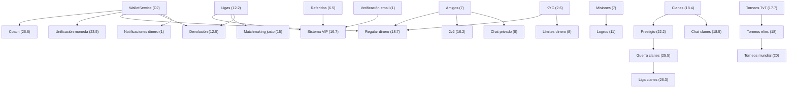

# UltimateClash — Roadmap Completo

> Última actualización: 2026-10-05
> Referencia: [`ARCHITECTURE.md`](file:///c:/Users/juand/Downloads/pagina/TorneosFlash/ARCHITECTURE.md) · [`project-conventions.md`](file:///c:/Users/juand/Downloads/pagina/TorneosFlash/agent/rules/project-conventions.md)

---

## Leyenda de modelos

| Abreviatura | Modelo | Fortaleza |
|---|---|---|
| **O4.6T** | Claude Opus 4.6 Thinking | Razonamiento profundo, seguridad, lógica financiera compleja. El más caro — usar solo donde un error cuesta dinero real o crea vulnerabilidades. |
| **O5.5H** | Claude Opus 5.5 High | Casi tan bueno como O4.6T para código, más rápido. Ideal para implementar fixes de seguridad, integraciones de pago, arquitectura. |
| **O5.5M** | Claude Opus 5.5 Medium | Buen balance. Torneos, matchmaking, refactors moderados. |
| **S5.5H** | Claude Sonnet 5.5 High | Workhorse. Features bien definidas, CRUD, tests, patrones establecidos. |
| **S5.5M** | Claude Sonnet 5.5 Medium | UI components, chat features, implementaciones estándar. |
| **S5.5L** | Claude Sonnet 5.5 Low | Config, texto, cambios simples, documentación. |
| **GPH** | Gemini Pro High | Bulk work, contexto grande (archivos enormes), migraciones masivas, boilerplate. Tienes MUCHOS tokens de este. |

> [!TIP]
> **Estrategia:** Opus para lo crítico (dinero, auth, arquitectura), Gemini para el volumen (frontend, CRUD, features repetitivas), Sonnet como puente.

---

## Fase 0: Arreglar antes de funcionalidades

### 0.1 — Seguridad (🔴 Crítico)

| # | Tarea | Modelo | Detalle |
|---|-------|--------|---------|
| S1 | JWT con httpOnly + secure + sameSite | **O5.5H** | Reemplaza cookie `userId` en texto plano. Middleware que inyecta `ctx.attribute("userId")`. |
| S2 | userId siempre de sesión JWT | **O5.5H** | Eliminar toda lectura de `userId` del body en TODOS los endpoints. Auditar cada `ctx.body()`. |
| S3 | Verificar admin en cada ruta `/api/admin/*` | **S5.5H** | Middleware `before("/api/admin/*")` que valide rol del JWT. Eliminar `/secret-admin/{username}`. |
| S4 | Sanitizar SQL injection | **O5.5H** | Auditar `GenericDAO` y cualquier `Statement.execute()` con strings del usuario → solo `PreparedStatement`. |
| S5 | Sanitizar XSS en chat | **S5.5H** | Frontend: `innerHTML` → `textContent` en `agregarBurbuja()`. Backend: escapar `<script>` antes de guardar. |
| S6 | No enviar hashes al frontend | **S5.5M** | Cambiar `SELECT *` por `SELECT id, username, saldo...` en respuestas al cliente. |
| S7 | Verificar firma webhook Wompi | **O5.5H** | Validar `x-event-checksum` con SHA256(evento + timestamp + secret). Sin esto, cualquiera simula un pago. |
| S8 | Rate limiting (anti-spam) | **S5.5H** | Javalin RateLimiter o middleware custom. 60 req/min por IP, 10 req/min en endpoints financieros. |
| S9 | Cookie/JWT secret como env var | **S5.5L** | Mover a `AppConfig`, leer de `System.getenv("JWT_SECRET")`. |
| S10 | Contraseña BD más segura | **S5.5L** | Cambiar en Render + actualizar env var `DATABASE_URL`. |

### 0.2 — Dinero (🔴 Crítico)

| # | Tarea | Modelo | Detalle |
|---|-------|--------|---------|
| D1 | `BigDecimal` en vez de `double` | **O5.5H** | Cambiar TODO el manejo de dinero. `rs.getBigDecimal()`, no `rs.getDouble()`. Afecta: `SocketHandler`, `RutasFinanzas`, `RutasDbAdmin`, `UsuarioDAO`. |
| D2 | Crear `WalletService` | **O4.6T** | Servicio centralizado: `depositar()`, `retirar()`, `apostar()`, `liquidar()`. Transacciones SQL atómicas (`conn.setAutoCommit(false)`). `WHERE saldo >= ?`. |
| D3 | Tabla `wallet_ledger` | **O4.6T** | `id, user_id, tipo (deposito/retiro/apuesta/premio/comision), monto, saldo_anterior, saldo_posterior, referencia, fecha`. Inmutable (solo INSERT). |
| D4 | Unificar lógica de comisiones | **O5.5M** | Duplicada entre `RutasDbAdmin` y `SocketHandler`. Mover a `ComisionService`. |
| D5 | Validar montos servidor | **S5.5H** | Positivos, dentro de rango, tipo correcto. Nunca confiar en el cliente. |

### 0.3 — Arquitectura backend

| # | Tarea | Modelo | Detalle |
|---|-------|--------|---------|
| A1 | netty-socketio | **O5.5H** | Reemplazar adaptador custom (`socketio/`). Más estable, soporta rooms, namespaces, reconexión automática. |
| A2 | Persistir estado en BD | **O5.5M** | Partidas activas, colas, búsquedas → tabla `active_matches` / `match_queue`. Al reiniciar: recuperar estado. |
| A3 | Capa de servicio para rutas | **S5.5H** | Los `Rutas*.java` solo parsean request y llaman a `*Service`. Lógica de negocio sale de los handlers. |
| A4 | Bus de eventos | **S5.5H** | `EventBus.emit("match.finished", data)`. Listeners desacoplados (notificaciones, leaderboard, misiones). |
| A5 | Flyway migraciones | **S5.5M** | Reemplazar `inicializarTablas()`. Scripts SQL versionados en `src/main/resources/db/migration/`. |
| A6 | Logs estructurados (SLF4J) | **GPH** | Reemplazar `System.out.println` por `logger.info()`. Configurar logback. |
| A7 | Configs a env vars | **S5.5L** | Auditar hardcoded en `Main.java`, `SocketHandler.java`. Todo a `AppConfig`. |
| A8 | Thread pool optimizado | **S5.5M** | Configurar executor Javalin correctamente. Separar pool para IO vs. computation. |

### 0.4 — Frontend

| # | Tarea | Modelo | Detalle |
|---|-------|--------|---------|
| F1 | Migrar a React + Vite | **GPH** | Crear proyecto con `npx create-vite`, migrar vistas/componentes gradualmente. Routing con React Router. |
| F2 | Dividir `app.js` en módulos | **GPH** | Parte de F1. Componentes: Auth, Lobby, Match, Chat, Finance, Leaderboard, Admin, Sorteos. |
| F3 | Estado centralizado | **GPH** | Context API o Zustand. Estado de usuario, socket, partida actual. |
| F4 | Mejorar diseño | **GPH** | Revisar UI/UX. Responsivo, dark mode, animaciones. Parte de la migración React. |
| F5 | Renombrar "apuestas" | **S5.5L** | Cambiar término en frontend y backend. Ej: "duelo", "reto", "desafío". |
| F6 | Build + minificación | **GPH** | Parte de Vite. Code splitting automático, tree shaking. |

### 0.5 — Limpieza

| # | Tarea | Modelo | Detalle |
|---|-------|--------|---------|
| L1 | Eliminar modelos POO sin uso | **S5.5L** | Verificar cuáles se usan realmente. `Administrador.java`, `Entidad.java`, etc. |
| L2 | `.gitignore` | **S5.5L** | `target/`, `*.class`, `.env`, `dependency-reduced-pom.xml`, `mvn-wrapper.zip`. |
| L3 | Eliminar archivos sueltos | **S5.5L** | `Test.java`, `TestError.java`, `TestWs.java`, `admin-db.html` duplicado en raíz. |

---

## Fase 1: Funcionalidades

> Los números de prioridad son los tuyos. Agrupados por bloque lógico.
> `(→ X)` = se podría adelantar al puesto X si conviene.

---

### Grupo 1 — Fundación de usuario (prioridad 1 – 2.6)

| Prio | Feature | Modelo | Notas |
|------|---------|--------|-------|
| **1** | Notificaciones de todos los movimientos de dinero del usuario | **S5.5H** | Depende de `WalletService` (D2). Cada operación del ledger emite evento → notificación push/in-app. |
| **1** | Verificación de email + primeros puntos VIP | **S5.5H** | Link de verificación vía Brevo (`CorreoServicio`). Al verificar: otorgar puntos VIP base. |
| **1.6** | Términos de servicio + política de privacidad | **S5.5L** | Páginas estáticas en React. Checkbox obligatorio al registrarse. **(→ se puede hacer en cualquier momento)** |
| **2** | 2FA opcional | **O5.5M** | TOTP (Google Authenticator). Generar QR con secret, verificar código de 6 dígitos al login. Tabla `user_2fa`. |
| **2.6** | KYC básico | **O5.5M** | Subir foto de documento + selfie. Admin aprueba. Tabla `user_kyc`. Necesario para retiros grandes. |

---

### Grupo 2 — Comunicación, social y configuración (prioridad 4.5 – 8)

| Prio | Feature | Modelo | Notas |
|------|---------|--------|-------|
| **4.5** | Configuración de notificaciones | **S5.5M** | Toggle por tipo: partidas, dinero, sorteos, leaderboard, amigos. Tabla `user_notification_settings`. |
| **6.5** | Sistema de referidos | **S5.5H** | Código único por usuario. Al registrarse con código: ambos reciben beneficio. Tabla `referrals`. Integrar con VIP. |
| **7** | Misiones | **S5.5H** | Misiones diarias/semanales. Motor de misiones genérico: `missions`, `user_missions`. Recompensa en tickets/puntos VIP. |
| **7** | Chat evidencias de pago | **S5.5M** | Adjuntar imagen al confirmar pago manual (Nequi). Admin ve la evidencia antes de aprobar. Usar `media_files`. |
| **7** | Sistema de amigos | **S5.5H** | Enviar solicitud, aceptar/rechazar, lista de amigos, ver estado online. Tablas: `friendships`, `friend_requests`. |
| **8** | Chat privado entre amigos | **S5.5M** | 1-a-1 vía Socket.IO rooms. Tabla `private_messages`. Depende de: Sistema de amigos. |
| **8** | Límites de dinero | **O5.5M** | Límite diario/semanal de apuestas y retiros. Configurable por admin y por nivel de verificación (KYC). |

---

### Grupo 3 — Progresión y educación (prioridad 10 – 12.5)

| Prio | Feature | Modelo | Notas |
|------|---------|--------|-------|
| **10** | Tutorial interactivo | **S5.5M** | Onboarding paso a paso al primer login. Overlay con tooltips guiados. Frontend-heavy. **(→ se puede hacer en cualquier momento después del frontend React)** |
| **11** | Logros | **S5.5H** | Similar al motor de misiones pero permanentes. `achievements`, `user_achievements`. Recompensas en tickets/VIP. Puede reusar infraestructura de misiones. |
| **12.2** | Ligas (arenas) | **O5.5H** | Trofeos/copas que suben/bajan con victorias/derrotas. Rangos: Bronce → Plata → Oro → etc. Al subir: desbloquear montos de apuesta mayores, multiplicador VIP. Tablas: `leagues`, `user_league`. Afecta matchmaking y devolución. |
| **12.5** | Sistema de devolución | **O4.6T** | Algoritmo complejo. Variables: duración partida, torres destruidas, daño, diferencia de copas, diferencia de arena, si tiene coach. Resultado: % de devolución (0–100%). Depende de: Ligas (12.2). |

---

### Grupo 4 — Competencia y social avanzado (prioridad 15 – 18.7)

| Prio | Feature | Modelo | Notas |
|------|---------|--------|-------|
| **15** | Matchmaking justo | **O5.5H** | Emparejar por rango de copas/arena + winrate. No solo por monto. Expandir cola con filtros. Depende de: Ligas (12.2). |
| **16.2** | 2v2 | **O5.5H** | Equipos de 2. Crear sala, invitar amigo, buscar rival 2v2. Liquidación dividida. Depende de: Sistema de amigos (7). |
| **16.7** | Sistema VIP | **O5.5M** | Puntos VIP se acumulan por actividad. Niveles VIP desbloquean: jugar entre amigos, stats detalladas, nombre personalizado, multiplicador en liga/misión/logro/devolución/referidos/tickets. Tablas: `vip_levels`, `user_vip`. |
| **17.7** | Torneos todos contra todos | **O5.5H** | Round-robin. El que más victorias tenga gana. Tablas: `tournaments`, `tournament_participants`, `tournament_matches`. |
| **18** | Torneos eliminatoria | **O5.5H** | Brackets de eliminación directa (octavos, cuartos, semis, final). Reutiliza tablas de torneos. |
| **18.4** | Clanes ⚠️ | **O5.5M** | Crear, unirse, salir. Líder + coleaderes. Tabla: `clans`, `clan_members`. **Movido de 20.2 → 18.4 porque Clan chat (18.5) depende de esto.** |
| **18.5** | Chat de clanes | **S5.5M** | Chat grupal del clan vía Socket.IO room. Depende de: Clanes (18.4). |
| **18.7** | Regalar/prestar dinero | **O4.6T** | Entre amigos. Anti-fraude: límites, cooldowns, verificación KYC. Depende de: Sistema de amigos (7), WalletService. |

---

### Grupo 5 — Plataforma avanzada y pagos (prioridad 20 – 26.6)

| Prio | Feature | Modelo | Notas |
|------|---------|--------|-------|
| **20** | Torneos tipo mundial | **O5.5H** | Fases de grupos + eliminatoria. Combina round-robin + brackets. Reutiliza infra de torneos 17.7/18. |
| **20** | Capacitor (app móvil) | **GPH** | Wrappear React app con Capacitor. Push nativo, splash screen. **(→ se puede empezar apenas React esté listo)** |
| **20** | Chatbot IA | **S5.5M** | FAQ automático + soporte básico. Integración con API de OpenAI/Gemini. **(→ independiente, se puede adelantar)** |
| **21** | Preguntas frecuentes + video | **S5.5L** | Página estática con FAQ y video tutorial embebido. **(→ se puede hacer en cualquier momento)** |
| **22** | PayPal | **O5.5H** | Integración con PayPal Checkout SDK. Webhook para confirmar pago. |
| **22.2** | Prestigio de clanes | **S5.5H** | XP del clan por actividad de miembros. Niveles de clan. Depende de: Clanes (18.4). |
| **22.6** | Pasarela: Llaves (transferencias bancarias) | **S5.5H** | Similar a Nequi manual: usuario transfiere, sube evidencia, admin aprueba. Agrupado con Nu y Daviplata. |
| **23** | Pasarela: Nequi API (automatizado) | **O5.5H** | Reemplazar flujo manual por API de Nequi. Webhook de confirmación. |
| **23.5** | Unificación de moneda (tokens internos) | **O4.6T** | Reemplazar COP por token interno. Tasa de conversión configurable. Afecta TODO el sistema de dinero. Refactor masivo del `WalletService`. |
| **24** | Cripto (pasarela) | **O5.5H** | USDT/BTC. Integración con Binance Pay, Coinbase Commerce, o similar. |
| **24.5** | Hablar con admin (sugerencias/problemas) | **S5.5M** | Sistema de tickets. Tabla `support_tickets`. **(→ independiente, se puede adelantar)** |
| **24.6** | Pasarela: Nu Colombia | **S5.5H** | Similar a Llaves. Transferencia manual + evidencia. Agrupado con las otras pasarelas locales. |
| **25.5** | Guerra de clanes | **O5.5H** | Tipo Clash of Clans: cada miembro elige rival del clan enemigo. Tablas: `clan_wars`, `clan_war_matches`. Depende de: Clanes + Prestigio. |
| **26.3** | Liga de clanes | **O5.5H** | Ranking de clanes por prestigio + guerras ganadas. Depende de: Guerra de clanes (25.5). |
| **26.6** | Coach | **O4.6T** | El coach paga para escoger estudiante. Gana si el estudiante gana Y el rival del coach también gana. Economía compleja → `// REVIEW-MONEY`. Tablas: `coaches`, `coach_sessions`. |

---

### Grupo 6 — Futuro lejano (prioridad 84+)

| Prio | Feature | Modelo | Notas |
|------|---------|--------|-------|
| **84** | Chat de voz (Discord bot) | **S5.5H** | Bot de Discord que crea canales de voz temporales por partida. Integración con Discord.js. Totalmente independiente del backend principal. |

---

## Mapa de dependencias

---

## Resumen por modelo (estimación de uso)

| Modelo | Tareas principales | % del proyecto |
|--------|-------------------|----------------|
| **O4.6T** | WalletService, ledger, devolución, regalar dinero, unificación moneda, coach | ~8% |
| **O5.5H** | JWT, SQL injection, Wompi, BigDecimal, netty-socketio, ligas, matchmaking, 2v2, torneos, PayPal, cripto, guerras | ~25% |
| **O5.5M** | 2FA, KYC, comisiones, límites, VIP, clanes, torneos mundial | ~15% |
| **S5.5H** | Admin middleware, XSS, rate limit, referidos, misiones, logros, amigos, pasarelas locales, prestigio | ~20% |
| **S5.5M** | Notif config, chat evidencias, chat privado, chat clanes, chatbot, soporte, tutorial | ~12% |
| **S5.5L** | TOS, renombrar apuestas, env vars, limpieza, FAQ, .gitignore | ~5% |
| **GPH** | Migración React+Vite, dividir app.js, diseño, logs SLF4J, Capacitor, build | ~15% |
